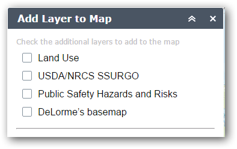
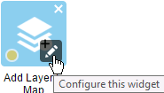
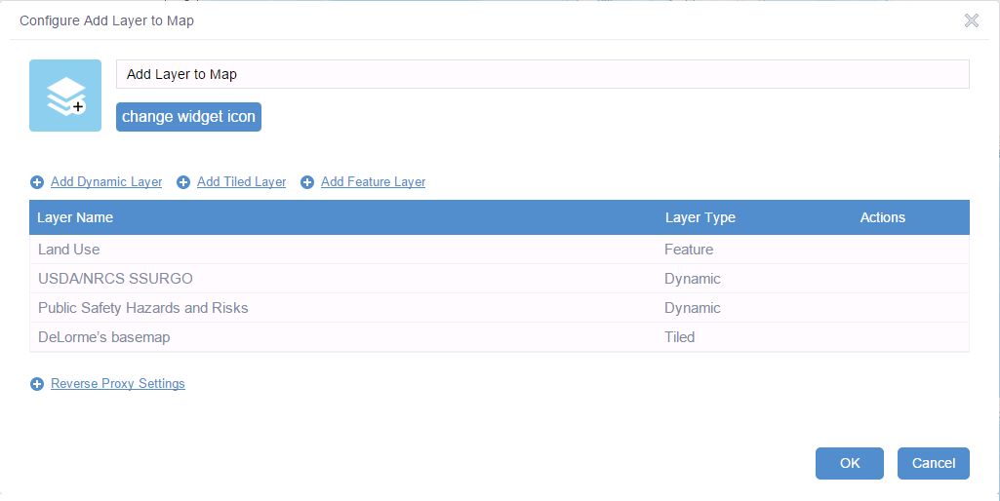
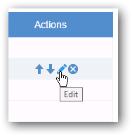
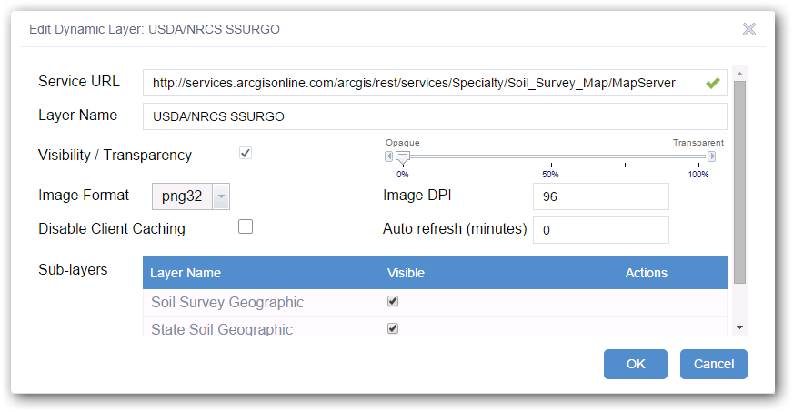
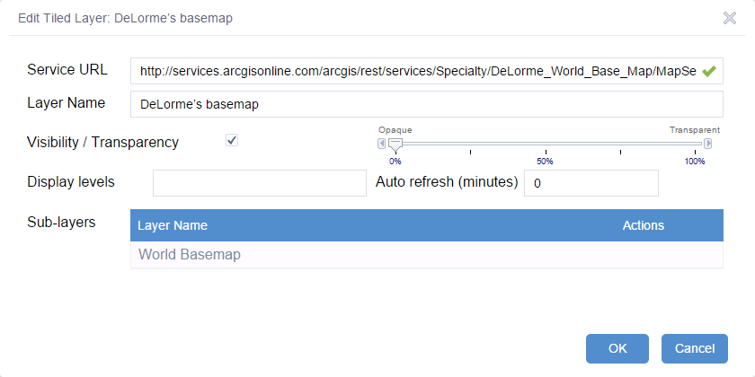
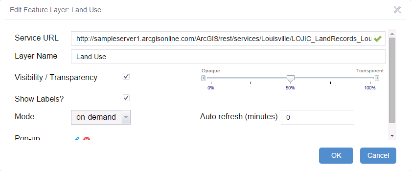
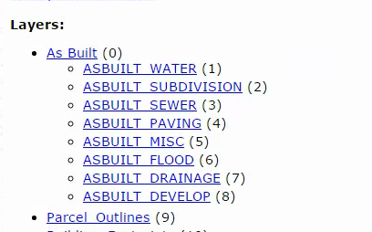
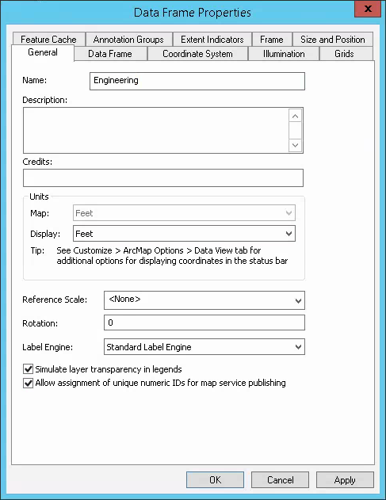

# AddLayer-Widget 1.2
The AddLayer Widget for ArcGIS Web AppBuilder allows users to add pre-defined map layers to the current map without having them to include them in the current web map. This provides an easy way to add ad-hoc layers to your web app.

Unlike the [AddService Widget](https://geonet.esri.com/docs/DOC-6263 "AddService Widget") which requires the user the enter the url of the service, the AddLayer widget only allows users to display additional map layers that have been pre-defined by the site administrator.

##Using the Widget
The AddLayer Widget is an in-panel widget that will be displayed in the toolbar of your WebApp Builder application. Click the  icon display the list of available layers. Click each layer you want to add to your map. These layers will be displayed on the map and may be toggled off or on using the standard LayerList widget. You can unclick the layers you do not want to show any more to remove them from the map. 

Each entry is the list is pre-defined when the configuring the widget.

## Adding the Widget to the Web AppBuilder
To add this widget to your ArcGIS WebApp Builder, 

* download the zip file of the widget
* unzip the contents into client\stemapp\widgets\AddLayer directory
* edit the \client\stemapp\config.json and enter the AddLayer widget in the widgets entry

Example:

	"widgets": [  
        {
            "uri": "widgets/AddLayer/Widget"
        }
    	...
    ]

## Configuring the Widget
Using the Web AppBuilder, click the edit icon on the AddLayer widget in the in-panel widgets to display the Configure Dialog.

To add your own layers to the widget, click the Add Dynamic Layer, Add Tiled Layer or Add Feature Layer links to display the Add Layer dialog.  
### Actions
Once a layer is added to the layers, you can hover over it's entry in the layer list to display the available Actions for the layer.

You can change the order that the layers are defined in the list, by clicking the Move Up or Move Down buttons. 

Click the pencil icon to show the Edit Dialog for the selected layer. 

Click the X icon to remove the layer from the Add Layer widget.

### Add Dynamic Layer
Click the Add Dynamic Layer link to display the dialog

**Service Url** = Enter the url for the map service and tab to the next field. When the Service Url field looses focus, the entered url is verified. If the map service is found, then a green check mark is displayed and the settings for the service are entered in the dialog.

**Layer Name** = enter the name for this layer which is displayed in the Add Layer widget

**Visibility** = when checked, the layer will be initially displayed when added to the map. For sub-layers to be displayed, the layer must be visible (checked) and the sub-layer must be visible (checked)

**Transparency** = use the slider to set the transparency of the layer. To see through the layer, choose a value greater than 0%  

**Image Format** = select the image format to use from the picklist

**Disable Client Caching** = When true, images are always requested from the server and the browser's cache is ignored

**Image DPI** = The output dpi of the dynamic map service layer

**Auto refresh** = To automatically refresh the layer without any user interaction, enter the number of minutes for the refresh interval. This can be useful for data that changes frequently like vehicle locations. To disable the autorefresh function, enter 0.

**Sub-layers** = the sub-layers for the map service are shown in the list. If the sub-layer should be initially displayed when added to the map, check the Visible checkbox. If the Visible checkbox is unchecked, then the layer will still be added to the map, but it will not be initially displayed. To display it, you can check the layer in the LayerList - the similar to the other layers in your webmap. 

If the service has sub-layers you do not want added to the map at all, hover over the actions column and click the delete button to remove it.

### Add Tiled Layer
Click the Add Tiled Layer link to add a tile cached map service

**Service Url** = Enter the url for the map service and tab to the next field. When the Service Url field looses focus, the entered url is verified. If the map service is found, then a green check mark is displayed and the settings for the service are entered in the dialog.

**Layer Name** = enter the name for this layer which is displayed in the Add Layer widget

**Visibility** = when checked, the layer will be initially displayed when added to the map. For the tiled layer to be displayed, the layer must be visible (checked)

**Transparency** = use the slider to set the transparency of the layer. To see through the layer, choose a value greater than 0% 

**Display Levels** = The comma-separated list of zoom levels to display the map, for example *0,1,2,3,4,5,6,7*. Leave blank to display at all levels

**Auto refresh** = To automatically refresh the layer without any user interaction, enter the number of minutes for the refresh interval. This can be useful for data that changes frequently like vehicle locations. To disable the auto refresh function, enter 0.

**Sub-layers** = the sub-layers for the map service are shown in the list. Because the tile cached includes the all the sub-layers in the image tiles, these should not be deleted.

### Add Feature Layer
A Feature Layer displays features from a single layer in either a Map Service or Feature Service
Click the Add Feature Layer link to add a feature layer

**Service Url** = Enter the url for the map service and tab to the next field. When the Service Url field looses focus, the entered url is verified. If the map service is found, then a green check mark is displayed and the settings for the service are entered in the dialog.

**Layer Name** = enter the name for this layer which is displayed in the Add Layer widget

**Visibility** = when checked, the layer will be initially displayed when added to the map. For the tiled layer to be displayed, the layer must be visible (checked)

**Transparency** = use the slider to set the transparency of the layer. To see through the layer, choose a value greater than 0%

**Show Labels** = Indicates whether to show labels on the layer. If the FeatureLayer has labeling defined on it, labels will automatically display if the Map's Show Labels is checked. 

**Mode** = The query mode for the feature layer. Each mode determines when and how many features are sent to the client.

- 
**snapshot**: features are fetched from the server. Once the features are fetched to the client, their "visibility" on the map is based on the time and spatial extents of the map. 

-
**on-demand**: features are fetched from the server as needed.

-
**selection**: only selected features are available on the client. Typically used in combination with a dynamic map service showing features that can be selected.

**Auto refresh** = To automatically refresh the layer without any user interaction, enter the number of minutes for the refresh interval. This can be useful for data that changes frequently like vehicle locations. To disable the auto refresh function, enter 0.

##FAQ
###The widget worked at first, but now it turns off the wrong sub-layers.
By default, layers in a map service are identified by an id number, which is shown in the REST endpoint for the service. In the service below, 
As\_Built\_Water is layer id = 1.

The Add Layer widget uses these layer ids to determine which layers to turn on (visibleLayers).

ArcGIS identifies the layer by numbering the layers by the order in the legend – so first layer is 1, the next layer is 2 etc. The problem comes in when you add a layer at the top of the legend and ArcGIS Server re-numbers all the layers. So now the layers in the service no longer match the layer ids configured in the widget. You could prevent this by only adding layers to the end of the legend. However, a better option is available at v10.3. In the Data Frame Properties for the MXD is an option called “Allow assignment of unique ids for map service publishing” . If you check that, the ids will be preserved when you add or re-order layers. So As\_Built\_Water would always have layer_id = 1 even if you move it to the bottom of the legend.

Full instructions are at [Map Authoring Considerations](http://server.arcgis.com/en/server/latest/publish-services/windows/map-authoring-considerations.htm#ESRI_SECTION1_4C54586DEB0445B4B97AF15856E546AB)

**Try setting this option for all MXDs that you use to publish map services. To fix the problem on a service that has already been changed, you can re-configure the Add Layer widget with the new ids. **

##Sponsors
**Thanks to the City of Garland, Texas for sponsoring the initial development of the AddLayer Widget and releasing it to the community.**

Portions of the configuration settings dialog for the AddLayer Widget were adapted from the configuration dialog of the excellent [LocalLayer Widget](https://github.com/cmndrbensisko/LocalLayer) .
